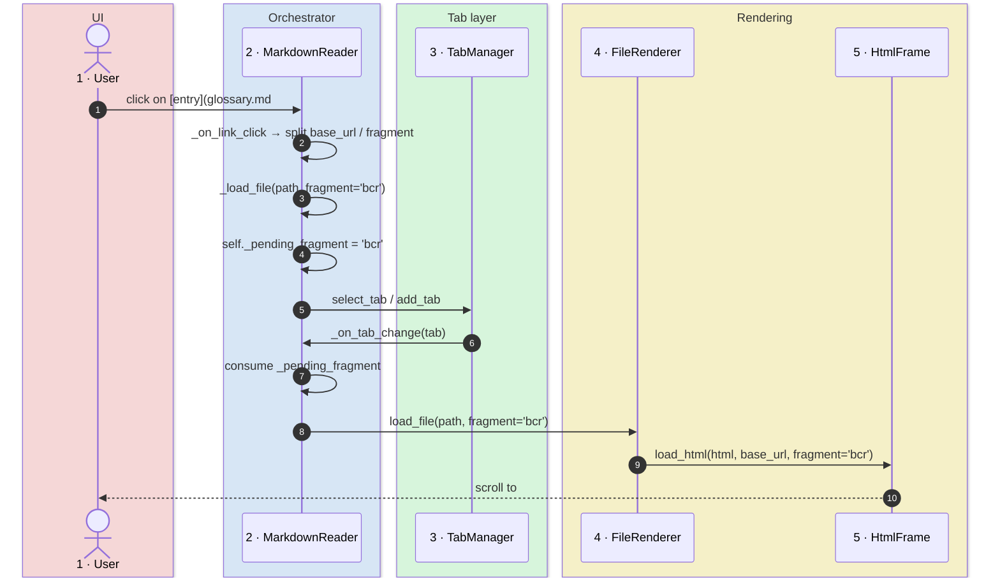
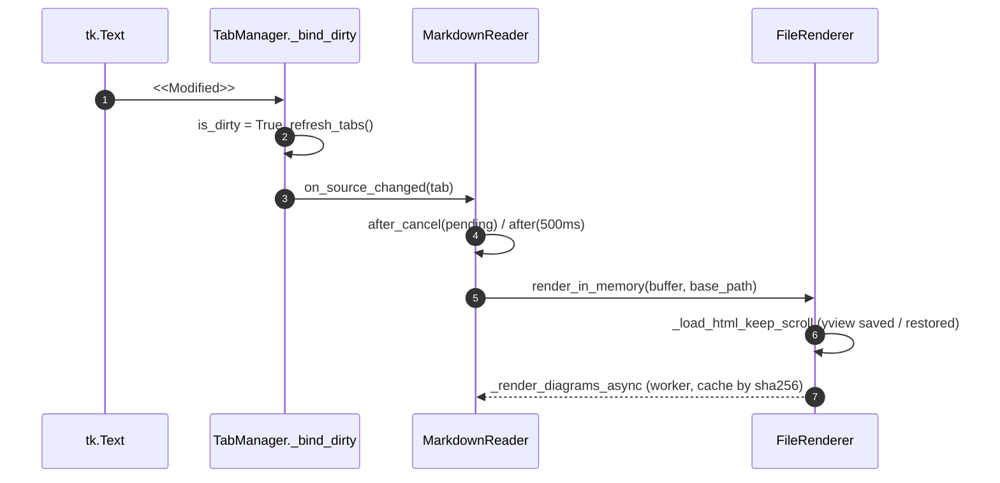

# Technical Analysis - Friedrich - Document Reader

## Technology Stack

The application is built on **Python 3.10+** and follows a three-tier architecture to ensure modularity and maintainability.

### Core Frameworks
- **GUI**: `tkinter` (Python's standard library for graphical interfaces).
- **Web Rendering**: `tkinterweb` (Tkhtml3-based engine for rendering HTML5/CSS3).
- **Markdown Engine**: `markdown` (Python library for MD → HTML conversion).
- **Image Processing**: `Pillow` (PIL) for handling and resizing diagrams.

### UI Integrity
The interface follows a strict **Design System** documented in `/ui`. Any change to existing widgets or addition of new components must honor the contracts defined in:
- `ui/UI_STRUCTURE.md`: layout and expansion consistency.
- `ui/DESIGN_TOKENS.md`: color and typography consistency.
- `ui/COMPONENT_CONTRACTS.md`: fixed dimensions and interactive behaviors.

### External Integrations (Diagrams and PDF)
The application extends standard Markdown capabilities by integrating external rendering engines:
1. **Mermaid**: Requires `mmdc` (Mermaid CLI) installed via npm. Diagrams are rendered asynchronously to PNG for embedding.
2. **Inline SVG**: Rasterized via `resvg-py` so embedded SVG fragments display correctly inside `tkinterweb`.
3. **PDF Export**: Uses **Microsoft Edge** in *headless* mode (via CLI) to guarantee 100% fidelity with the on-screen rendering, including custom CSS and diagrams.
4. **PDF Viewing**: Native, in-app PDF viewer backed by **`pypdfium2`** (Google's PDFium bindings). See the dedicated architectural pattern below.

### Caching and Performance
- **Diagram Cache**: Implemented in `services/diagram_cache.py`. Uses SHA-256 hashing of the diagram source to avoid redundant renders, speeding up loading of complex documents.
- **Async Rendering**: Mermaid and inline SVG diagrams are processed in separate threads (`threading`) to avoid blocking the GUI during load.

### System Requirements
- **OS**: Windows (optimized), Linux, macOS.
- **Python dependencies**: See `requirements.txt`.
- **External dependencies**: Node.js/mmdc (for Mermaid), Microsoft Edge (for PDF).

## Architectural Pattern: Sidebar Toggle (PanedWindow Management)

### Context
The sidebar is managed as a dynamic pane inside a `ttk.PanedWindow` to support toggling and resizing.

### Implementation
Files involved:
- `md_reader.py`: toggle logic (`_toggle_sidebar`, `_show_sidebar_ui`, `_hide_sidebar_ui`).
- `widgets/nav_rail.py`: command bindings for the navigation rail icons.

### Correct Pattern
```python
# Show: Reinsert pane if not present, set weights
if str(self.sidebar_panel) not in [str(p) for p in self.main_paned.panes()]:
    self.main_paned.insert(0, self.sidebar_panel)
self.main_paned.pane(self.sidebar_panel, weight=0)  # Fixed width
self.main_paned.pane(self.workspace_container, weight=1)  # Expandable

# Hide: Remove pane with forget, save width before
actual_width = self.sidebar_panel.winfo_width()
self.main_paned.forget(self.sidebar_panel)
```

### Common Tkinter PanedWindow Pitfalls
1. **`minsize` in `.pane()`**: only valid on `.add()`, not on `.pane()`.
2. **`sash_place(x, y, z)`**: the method accepts only 2 parameters `(index, newpos)`.
3. **Duplicate bindings**: avoid binding the same command on both a container and its children.
4. **State inconsistency**: sync `ctx.left_visible` before mutating the paned window.

### Testing
- Toggle repeatedly (5+ times) to validate stability.
- Verify that sash resize still works.
- Confirm that the width is properly saved and restored.

## Architectural Pattern: Anchor Navigation (Fragment Threading)

### Context
Markdown links may carry a fragment (`file.md#anchor` or `#anchor`). `tkinterweb.HtmlFrame.load_html` natively supports a `fragment=` parameter that scrolls the viewport to the element with the matching `id` after parsing. The challenge is that the navigation chain (click → tab open → render) must propagate the fragment from the click handler all the way to the final `load_html` call.

### Flow


### Files Involved
- `md_reader.py`: `_on_link_click` extracts and URL-decodes the fragment, `_load_file` stashes it into `self._pending_fragment`, `_on_tab_change` consumes it and forwards it to the renderer.
- `services/file_renderer.py`: `load_file(..., fragment=None)` forwards the fragment to `html_frame.load_html(..., fragment=fragment)`. The value is also stored in `ctx.last_fragment` so the async post-diagram rerender (`update_html`) preserves the scroll position.

### Notes on Heading IDs
The `markdown` engine is invoked with the `tables` and `fenced_code` extensions but **without** `toc`. Heading IDs must therefore be supplied explicitly in the source via inline HTML tags (e.g. `### <a id="bcr"></a>BCR`), which Python-markdown preserves in the HTML output. If GitHub-style auto-slugify is needed in the future, add the `toc` extension while making sure it does not collide with the pre-existing manual anchors.

### Intra-document Fragments and the Directory `base_url` Trap
Same-file TOC links written as `[entry](#sec-1)` are emitted by Python-markdown as `<a href="#sec-1">`. In `services/file_renderer.py` the `base_url` passed to `HtmlFrame.load_html` is set to the file's **parent directory** (`path.parent.as_uri() + "/"`) so that relative links to sibling files (`glossary.md`, `images/foo.png`) resolve correctly.

Side effect: tkinterweb resolves `#sec-1` against that directory base, so the URL forwarded to `_on_link_click` becomes `file:///C:/.../<dir>/#sec-1` — i.e. a `file://` URL whose path component is a **directory**, not the current file. The pre-existing `elif ... url.startswith("#")` branch never fires (the URL is already prefixed with `file://`), and the final `path.is_file()` guard rejects the directory, silently dropping the fragment.

The fix in `_on_link_click` adds an explicit branch right before the `is_file()` guard:

```python
if path.exists() and path.is_dir() and fragment and tab.path.exists():
    self._renderer.load_file(tab.path, push_history=False, fragment=fragment)
    return False
```

When the resolved path is a directory and a fragment is present, the click is routed to the renderer against the **current tab's path**, reusing the same fragment-threading machinery used for cross-file links. This keeps the directory-based `base_url` (which is required for relative file/image resolution) and adds intra-document anchor support without touching the rest of the dispatch chain.

## Architectural Pattern: In-App PDF Viewer

### Context
PDF files opened from a Markdown link or via the file dialog are rendered inside a dedicated tab by `widgets/pdf_viewer.py`, on top of `pypdfium2` (PDFium ABI bindings). The widget shares the tab/zoom plumbing with `HtmlFrame` tabs but does **not** route through `tkinterweb`, since it rasterizes pages directly to a `tk.Canvas`.

### Continuous Scroll and Zoom
Pages are pre-rendered via `PdfPage.render(scale=...)` and placed sequentially on the canvas with a fixed gap. Zoom is global (`ctx.zoom_level`), the same level used for Markdown previews; `set_zoom` re-rasterizes all pages and preserves the vertical scroll fraction.

### Render Coalescing
Multiple triggers can request a re-render in rapid succession (zoom change, window resize via `<Configure>`, deferred render when the canvas is not yet sized). Without coalescing, two `_render` invocations would interleave: one would call `_photo_images.clear()` while the other was still iterating the list, leaving the canvas with dangling item ids.

The fix is a `_render_pending` flag combined with `after_idle`:

```python
def _schedule_render(self) -> None:
    if self._render_pending:
        return
    self._render_pending = True
    self.after_idle(self._render)
```

Any number of triggers in the same idle cycle collapse into a single render pass.

### Page Cap
A naive "render everything up front" strategy degrades quickly: at 200% zoom an A4 page is roughly 30 MB of `PhotoImage` memory, so a 100-page PDF would consume ~3 GB and freeze the main thread for tens of seconds. The viewer caps the pre-rendered range at `MAX_PAGES = 50` and emits a `toast.pdf_truncated` notice (i18n) when the document is larger. Future work: viewport-driven on-demand rendering would lift the cap.

### Error Isolation
Per-page render failures (corrupted page, decoder errors) are caught individually and the loop continues with the next page rather than aborting the whole document. The PDF document handle is closed in a `try/finally` and any exception during close is logged via `traceback.print_exc()` instead of being silently swallowed.

## Architectural Pattern: Windows Taskbar Identity (AppUserModelID)

### Context
Friedrich is launched via `pythonw.exe` from the project's `.venv`. By default Windows groups taskbar windows by executable, so the running window inherits the icon and tooltip of `pythonw.exe` rather than `app_icon.ico`. Pinning the app to the taskbar makes the divergence permanent: the pinned shortcut points at `pythonw.exe` and the icon never recovers.

### Solution: paired AppUserModelID
Windows resolves window-↔-pin-↔-icon associations through the **AppUserModelID** (AUMID). The fix is to declare the same AUMID in two places:

1. **At runtime**, in `md_reader.py` `__main__`, before any Tk window is created:
   ```python
   if sys.platform == "win32":
       try:
           import ctypes
           ctypes.windll.shell32.SetCurrentProcessExplicitAppUserModelID(
               "Friedrich.MarkdownReader")
       except Exception:
           pass
   ```
2. **Embedded as a property** on the launcher `.lnk` (`C:\Blexin\Tools\md_reader.lnk`). Property: `System.AppUserModel.ID` (PKEY_AppUserModel_ID, fmtid `9F4C2855-9F79-4B39-A8D0-E1D42DE1D5F3`, pid 5). The shortcut also has `TargetPath = ...\.venv\Scripts\pythonw.exe` so the venv interpreter is used.

The helper `scripts/set_lnk_appid.ps1` writes the AUMID into a `.lnk` via `IShellLink` + `IPropertyStore`. Usage:
```powershell
.\scripts\set_lnk_appid.ps1 -LnkPath 'C:\Blexin\Tools\md_reader.lnk' -AppId 'Friedrich.MarkdownReader'
```

The script validates that the input path has a `.lnk` extension and rejects shell-namespace parsing names (`::{GUID}\...`) before calling `SHGetPropertyStoreFromParsingName`. Without these guards, the API would happily open an `IPropertyStore` on arbitrary files (e.g. Office documents, OLE storages) and corrupt them on commit.

### Why the AUMID string still says "MarkdownReader"
After the "Markdown Reader" → "Document Reader" rebrand, the AUMID was deliberately left as `Friedrich.MarkdownReader` rather than renamed to `Friedrich.DocumentReader`. The AUMID is the **identity key** for taskbar pins: changing it would invalidate every existing pin and force users to re-pin via the `.lnk` drag-and-drop procedure described above. The rebrand is purely cosmetic (window title, README, launchers, i18n strings); the identity is intentionally stable. If a future redesign warrants a fresh identity, both `md_reader.py` and the helper invocation must be updated together, and users must be notified to re-pin.

### Pinning the app correctly
Once both places carry the same AUMID, the pin **must be created by dragging the prepared `.lnk` onto the taskbar** (or right-click → "Show more options" → "Pin to taskbar" on the `.lnk` itself). Windows then clones the file and inherits the embedded AUMID.

Pinning from a running window on Windows 11 is **not** equivalent: the OS may instead create a pinned shortcut named `Python.lnk` whose `TargetPath` is the raw `pythonw.exe` (no AUMID, no embedded icon). Symptoms: tooltip "python", icon of the Python interpreter. If this happens, unpin and redo via drag-and-drop of the prepared `.lnk`.

### Icon cache caveat
After AUMID/icon changes, the Windows shell may keep stale tiles in its icon cache. To force a refresh: stop `explorer.exe`, delete `%LOCALAPPDATA%\Microsoft\Windows\Explorer\iconcache_*.db` and `thumbcache_*.db`, restart `explorer.exe`.

## Architectural Pattern: View Modes and Live Preview

### Context
Each document tab owns both an `HtmlFrame` (preview) and a `tk.Text` (editor). Historically they were packed directly into the tab container and swapped with `pack_forget`. The split view needs both visible at once, and Tk widgets cannot be re-parented, so the layout was moved to a per-tab horizontal `ttk.PanedWindow` created once in `TabManager._build_document_views`.

### View mode contract
`TabInfo.view_mode` is one of `preview`, `source`, `split` (`widgets/tab_manager.py: VIEW_MODES`). `TabManager.apply_view_mode(tab)` is the single place that translates the mode into panes:

| Mode      | Panes (left → right)          |
|-----------|-------------------------------|
| `preview` | `html_frame`                  |
| `source`  | `source_frame`                |
| `split`   | `source_frame`, `html_frame`  |

Panes not wanted are `forget`-ed, missing ones are `insert`-ed at their position (`"end"` when the index equals the pane count, which ttk rejects as numeric). PDF and RSVP tabs have `view_paned is None` and are untouched.

### Sash placement
ttk sizes a freshly inserted pane from its requested width, so the second pane can collapse to zero. `TabManager._center_sash` sets `sashpos(0, width // 2)` after a short delay, verifies the result and retries a few times: a `sashpos` issued before the first layout pass is overwritten by that pass.

### Buffer-authoritative rule
`MarkdownReader._set_view_mode(tab, mode)` computes which surface *appears*:

- editor appears (`preview → source|split`) and the tab is clean → `_fill_source_from_disk`; dirty or untitled tabs keep their buffer;
- preview appears (`source → preview|split`) → `_refresh_preview_from_editor`: dirty, untitled or Markdown tabs render the buffer via `FileRenderer.render_in_memory`; other extensions (`.log`, `.csv`, code, images) go through `load_file` so their dedicated renderer is used.

`FileRenderer.load_file` honours `split` by filling both surfaces (`show_html` / `show_source` flags). `update_html`, the search bar, PDF export and the Markdown theme switch treat `split` like `preview` for the HTML side and like `source` for the text side.

### Live preview


The debounce job is cancelled on every keystroke and on view-mode changes; leaving `split` for `preview` with a pending job flushes it so the preview is not one edit behind. Only Markdown extensions (`MARKDOWN_EXTS`) and untitled tabs are live-rendered.

Diagram workers are stamped with `FileRenderer._render_seq`: a worker whose stamp is no longer the latest merges its PNGs into the registry but does not touch the HTML frame, so a slow `mmdc` run cannot revert the preview to older text. No worker is started when the document has no Mermaid / SVG block. Untitled tabs cache their diagrams under their virtual name (`untitled-N`).

Programmatic loads of the editor go through `TabInfo.set_source`, which temporarily enables a disabled (read-only) widget, calls `edit_reset()` (a disk read is not an undoable action, otherwise a single Undo would empty the buffer) and resets the modified flag. The Markdown theme switch re-renders only the HTML side (`_render_live_preview` for dirty / untitled / clean-Markdown-in-split tabs) and never reloads the editor.

### Cache key on worker threads
`diagram_cache` keeps a module-level "current document" for callers on the UI thread, but the async worker captures `cache_document()` at spawn time and passes it down (`inject_mermaid_svgs(..., doc=)` → `cache_get/put(..., doc)`). Without this, a tab switch during a slow `mmdc` run would file the PNGs under the newly selected document's folder.

### The buffer is never overwritten by a disk load
`FileRenderer._may_replace_buffer()` gates both `show_source` branches of `load_file`: when the active tab is dirty or untitled, no disk content is written into the editor. This is the single choke point for every caller — tab switch, anchor navigation, refresh, theme change — because `set_source` also clears the undo stack, so an overwrite would be unrecoverable. Anchor clicks route through `MarkdownReader._render_from_buffer_or_disk`, which re-renders an unsaved buffer (`render_in_memory(..., fragment=)`) instead of re-reading the file, so a table-of-contents link inside a document being edited scrolls without touching the text.

### External modifications and read-only tabs
`TabInfo.last_mtime` is the mtime of the content the buffer is based on (set on load and save). `_on_tab_change` never reloads a dirty tab whose file changed on disk; it shows `toast.file_changed_on_disk` once (`external_change_notified`). `_save_current` runs `_confirm_overwrite_if_changed`, an `askyesno` gate when the disk mtime differs from `last_mtime`. Image tabs set `read_only`: the editor widget is `state="disabled"`, dirty tracking is not installed, `EditorActions._target` returns `None` and both save paths refuse with `toast.read_only_file`.

### UI theme rebuild
`_toggle_ui_theme` destroys and recreates every widget. Before doing so it snapshots each tab (`_snapshot_tab`: path, untitled, dirty, view mode, zoom, base mtime and the buffer for dirty / untitled tabs) and replays them with `_restore_tab` (`add_untitled_tab` or `_load_file`, `_set_view_mode`, `set_source`, `apply_zoom(quiet=True)`). A file that disappeared meanwhile is restored as an untitled tab when it still carries unsaved text, and dropped otherwise; the active tab is re-mapped through the list of positions actually restored, since a dropped tab shifts every later index.

### Where the rendered body lives
`FileRenderer._remember_body` stores each render on the active `TabInfo` (`last_html_body`) as well as on the context. `apply_zoom` repaints from the *tab's* copy, so zooming a `.log`, `.csv`, code or image tab no longer paints the last Markdown document into it. `ctx.last_fragment` is consumed (and cleared) by `update_html`, so the anchor is re-applied exactly once — after the async diagram swap changes the document height — and never disables scroll preservation afterwards.

### Scroll preservation and untitled tabs
`FileRenderer._load_html_keep_scroll` records `HtmlFrame.yview()[0]` before `load_html` and restores it 50 ms later, unless a fragment is requested. It is used by `render_in_memory` and by `update_html` (the async diagram swap), so neither the live preview nor a late diagram jumps the reader to the top. `update_html` also resolves the `base_url` of untitled tabs against `ctx.scan_dir`: their virtual path is relative and `Path(".").as_uri()` raises.

## Architectural Pattern: Editor Syntax Highlighting

### Design
`services/md_highlighter.py` separates a pure tokenizer from the Tk binding:

- `tokenize(lines, first, last) -> list[Token]` scans every line from the top to track fenced-code state (```` ``` ```` / `~~~`, matching marker family and length), but emits tokens only for the requested window. Block rules run first (fence, rule, heading, quote, list marker, table pipes), then inline rules; code spans are matched first and shield their content from emphasis, links, images and HTML.
- `MarkdownHighlighter(text, palette, font_family, font_size)` configures one tag per token kind (`TAGS`), lowers them below later tags such as the search highlights, and re-tags the visible range ± 100 lines, debounced at 150 ms. Triggers: `<<Modified>>` (also fired by programmatic inserts, since Tk queues the event before `edit_modified(False)` is reached), `<Configure>` and the `yscrollcommand` wrapper installed by `TabManager`.
- Palettes are `MD_SYNTAX_DARK` / `MD_SYNTAX_LIGHT` in `constants.py`, chosen from `ctx.ui_theme`. `FileRenderer.apply_zoom` calls `set_font_size` so bold/italic tag fonts follow the editor font.

### Formatting commands
`services/md_editing.py` holds pure functions returning an `EditResult(text, sel_start, sel_end)`; `widgets/editor_actions.py` maps them onto the active `tk.Text`. Each command is applied with `Text.replace(start, end, new)`, which Tk records as a single undo step, wrapped in `edit_separator()` calls. Line-oriented commands extend the selection to whole lines and drop a trailing selection that ends at column 0 so the next line is not dragged in.

Shortcuts are installed per editor widget by `TabManager` (`source_key_bindings`) and return `"break"`: `Ctrl+I` would otherwise trigger the Text class binding that inserts a tab. `Ctrl+B` remains the sidebar toggle, so bold is `Ctrl+Shift+B`. The Edit menu (`Toolbar._show_edit_menu`) gates every entry on `EditorActions.can_edit()`, which is false in preview mode and for PDF / RSVP tabs.

## Architectural Pattern: Editor Ergonomics

### Split of responsibilities
The behaviour lives in pure functions (`services/md_editing.py`) and the Tk plumbing in `widgets/editor_actions.py`, the same split used by the formatting commands:

| Concern | Pure function | Tk adapter |
|---------|---------------|------------|
| Tab with no selection | `spaces_to_tab_stop(column)` | `EditorActions.indent` |
| Tab / Shift+Tab on a selection | `indent_block`, `outdent_block` | `EditorActions.indent` / `outdent` |
| Shift+Tab with no selection | `outdent_before_caret(prefix)` | `EditorActions.outdent` |
| Enter | `continue_list(line) -> Continuation \| None` | `EditorActions.newline` |

`continue_list` returns `None` for a line that is not a list, task or quote, and `Continuation(clear_line=True)` for an item whose body is empty. Indentation is measured in `INDENT_WIDTH` (4) spaces; a literal tab counts as one full level when out-denting.

### Handlers that decline
`TabManager` installs these on the editor through `source_key_bindings` and now honours the handler's return value:

```python
tab.source_text.bind(sequence, lambda e, h=handler: "break" if h() is not False else None)
```

The protocol has three outcomes:

| Return | Meaning | Effect |
|--------|---------|--------|
| `False` | declined, but the editor is live | Tk applies its own binding (Enter on ordinary text inserts a newline) |
| `True` | handled | the key is swallowed |
| `None` | there is no editable surface (preview, read-only tab) | the key is swallowed, so Tk cannot type into a hidden or read-only buffer |

### Keys must not reach a hidden editor
In preview the editor is unmapped but can still hold the keyboard focus. Moving the focus to the `HtmlFrame` is **not** an option: `Tab` on a focused tkinterweb frame segfaults the interpreter (reproduced on tkinterweb 4.25.2). Instead `TabManager._guard_hidden_keys`, bound to `<Key>`, swallows anything printable while `view_mode == "preview"`, and lets Control/Alt combinations through so the global shortcuts (Ctrl+S, Ctrl+F…) keep working. `Tab` and `Enter` are covered by their own bindings returning `None`.

### Fenced code blocks
`EditorActions.newline` asks `services.md_highlighter.is_inside_fence` before continuing a list, so a `- removed line` inside a ```` ```diff ```` block is left alone. The scan only runs when the line already looks like a list item, so ordinary prose pays nothing for it.

### Gutter
`widgets/line_numbers.py` is a `tk.Canvas` packed to the left of the editor inside `source_frame`. It walks the visible **line numbers** and measures each one with `dlineinfo(f"{line}.0")`: the index must carry column 0, because with `wrap="word"` an index holding a real column resolves to a continuation row and would place the number tens of pixels off. `dlineinfo` returns `None` only for the topmost line when its first row is scrolled above the viewport; that number is pinned to the top edge so the line being read always has one. Redraws are coalesced with `after_idle`; the triggers are the `yscrollcommand` wrapper, `<Configure>`, and the caret events below. Its width is recomputed from the digit count and the font, so it grows at 100 and 1000 lines and follows `apply_zoom` through `set_font_size`.

### Caret tracking
Tk fires no event when the insertion mark moves, so `TabManager` binds one handler to `<KeyRelease>`, `<ButtonRelease-1>`, `<<Modified>>`, `<Configure>`, `<MouseWheel>` and the custom `<<CaretMoved>>`, and both the gutter and `widgets/current_line.py` follow it. `EditorActions._finish` emits `<<CaretMoved>>` so programmatic edits update the same way. `CurrentLineHighlight` re-tags only when the line number actually changes, and keeps its tag at the bottom of the priority stack: it sets `background` only, so the syntax colours (`foreground`) are untouched and the selection and search highlights stay on top.

### Atomic save
`SaveMarkdownUseCase._write` writes to a `NamedTemporaryFile` created **in the destination folder** (so the swap cannot cross a filesystem), flushes it and calls `os.fsync`, then swaps it over the target through `_replace_preserving_metadata`. On any `OSError` the temporary file is removed and the previous version is left untouched. The temporary name is prefixed with a dot, capped at 60 characters of the document name and suffixed `.tmp`: without the cap, a long file name plus tempfile's random suffix could exceed the 255-character component limit and make the document unsavable.

The swap itself is `ReplaceFileW` on Windows and `shutil.copymode` + `os.replace` elsewhere. `os.replace` alone hands the document the *temporary file's* security descriptor, so an explicit ACE (say `Everyone:(R)`) would be silently dropped on every save; `ReplaceFileW` is the documented API for replacing a file while keeping its ACLs, attributes and creation time, and the portable pair is used when it refuses (some network shares). The containing directory is not fsync'd, so the rename is not durable across a power loss — acceptable for a desktop editor.

