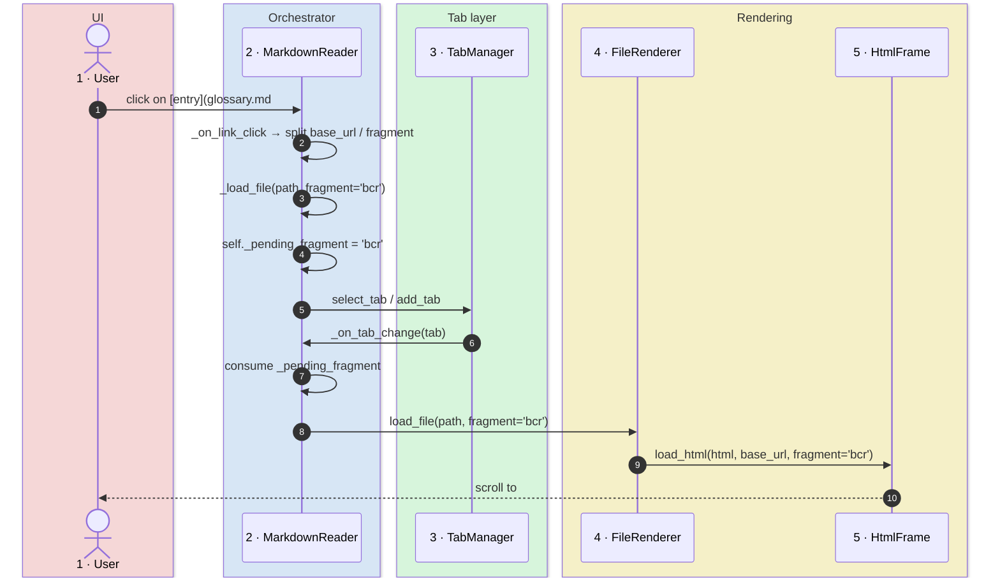

# Technical Analysis - Friedrich - Document Reader

## Technology Stack

The application is built on **Python 3.10+** and follows a three-tier architecture to ensure modularity and maintainability.

### Core Frameworks
- **GUI**: `tkinter` (Python's standard library for graphical interfaces).
- **Web Rendering**: `tkinterweb` (Tkhtml3-based engine for rendering HTML5/CSS3).
- **Markdown Engine**: `markdown` (Python library for MD → HTML conversion).
- **Image Processing**: `Pillow` (PIL) for handling and resizing diagrams.

### UI Integrity
The interface follows a strict **Design System** documented in `/ui`. Any change to existing widgets or addition of new components must honor the contracts defined in:
- `ui/UI_STRUCTURE.md`: layout and expansion consistency.
- `ui/DESIGN_TOKENS.md`: color and typography consistency.
- `ui/COMPONENT_CONTRACTS.md`: fixed dimensions and interactive behaviors.

### External Integrations (Diagrams and PDF)
The application extends standard Markdown capabilities by integrating external rendering engines:
1. **Mermaid**: Requires `mmdc` (Mermaid CLI) installed via npm. Diagrams are rendered asynchronously to PNG for embedding.
2. **Inline SVG**: Rasterized via `resvg-py` so embedded SVG fragments display correctly inside `tkinterweb`.
3. **PDF Export**: Uses **Microsoft Edge** in *headless* mode (via CLI) to guarantee 100% fidelity with the on-screen rendering, including custom CSS and diagrams.
4. **PDF Viewing**: Native, in-app PDF viewer backed by **`pypdfium2`** (Google's PDFium bindings). See the dedicated architectural pattern below.

### Caching and Performance
- **Diagram Cache**: Implemented in `services/diagram_cache.py`. Uses SHA-256 hashing of the diagram source to avoid redundant renders, speeding up loading of complex documents.
- **Async Rendering**: Mermaid and inline SVG diagrams are processed in separate threads (`threading`) to avoid blocking the GUI during load.

### System Requirements
- **OS**: Windows (optimized), Linux, macOS.
- **Python dependencies**: See `requirements.txt`.
- **External dependencies**: Node.js/mmdc (for Mermaid), Microsoft Edge (for PDF).

## Architectural Pattern: Sidebar Toggle (PanedWindow Management)

### Context
The sidebar is managed as a dynamic pane inside a `ttk.PanedWindow` to support toggling and resizing.

### Implementation
Files involved:
- `md_reader.py`: toggle logic (`_toggle_sidebar`, `_show_sidebar_ui`, `_hide_sidebar_ui`).
- `widgets/nav_rail.py`: command bindings for the navigation rail icons.

### Correct Pattern
```python
# Show: Reinsert pane if not present, set weights
if str(self.sidebar_panel) not in [str(p) for p in self.main_paned.panes()]:
    self.main_paned.insert(0, self.sidebar_panel)
self.main_paned.pane(self.sidebar_panel, weight=0)  # Fixed width
self.main_paned.pane(self.workspace_container, weight=1)  # Expandable

# Hide: Remove pane with forget, save width before
actual_width = self.sidebar_panel.winfo_width()
self.main_paned.forget(self.sidebar_panel)
```

### Common Tkinter PanedWindow Pitfalls
1. **`minsize` in `.pane()`**: only valid on `.add()`, not on `.pane()`.
2. **`sash_place(x, y, z)`**: the method accepts only 2 parameters `(index, newpos)`.
3. **Duplicate bindings**: avoid binding the same command on both a container and its children.
4. **State inconsistency**: sync `ctx.left_visible` before mutating the paned window.

### Testing
- Toggle repeatedly (5+ times) to validate stability.
- Verify that sash resize still works.
- Confirm that the width is properly saved and restored.

## Architectural Pattern: Anchor Navigation (Fragment Threading)

### Context
Markdown links may carry a fragment (`file.md#anchor` or `#anchor`). `tkinterweb.HtmlFrame.load_html` natively supports a `fragment=` parameter that scrolls the viewport to the element with the matching `id` after parsing. The challenge is that the navigation chain (click → tab open → render) must propagate the fragment from the click handler all the way to the final `load_html` call.

### Flow


### Files Involved
- `md_reader.py`: `_on_link_click` extracts and URL-decodes the fragment, `_load_file` stashes it into `self._pending_fragment`, `_on_tab_change` consumes it and forwards it to the renderer.
- `services/file_renderer.py`: `load_file(..., fragment=None)` forwards the fragment to `html_frame.load_html(..., fragment=fragment)`. The value is also stored in `ctx.last_fragment` so the async post-diagram rerender (`update_html`) preserves the scroll position.

### Notes on Heading IDs
The `markdown` engine is invoked with the `tables` and `fenced_code` extensions but **without** `toc`. Heading IDs must therefore be supplied explicitly in the source via inline HTML tags (e.g. `### <a id="bcr"></a>BCR`), which Python-markdown preserves in the HTML output. If GitHub-style auto-slugify is needed in the future, add the `toc` extension while making sure it does not collide with the pre-existing manual anchors.

### Intra-document Fragments and the Directory `base_url` Trap
Same-file TOC links written as `[entry](#sec-1)` are emitted by Python-markdown as `<a href="#sec-1">`. In `services/file_renderer.py` the `base_url` passed to `HtmlFrame.load_html` is set to the file's **parent directory** (`path.parent.as_uri() + "/"`) so that relative links to sibling files (`glossary.md`, `images/foo.png`) resolve correctly.

Side effect: tkinterweb resolves `#sec-1` against that directory base, so the URL forwarded to `_on_link_click` becomes `file:///C:/.../<dir>/#sec-1` — i.e. a `file://` URL whose path component is a **directory**, not the current file. The pre-existing `elif ... url.startswith("#")` branch never fires (the URL is already prefixed with `file://`), and the final `path.is_file()` guard rejects the directory, silently dropping the fragment.

The fix in `_on_link_click` adds an explicit branch right before the `is_file()` guard:

```python
if path.exists() and path.is_dir() and fragment and tab.path.exists():
    self._renderer.load_file(tab.path, push_history=False, fragment=fragment)
    return False
```

When the resolved path is a directory and a fragment is present, the click is routed to the renderer against the **current tab's path**, reusing the same fragment-threading machinery used for cross-file links. This keeps the directory-based `base_url` (which is required for relative file/image resolution) and adds intra-document anchor support without touching the rest of the dispatch chain.

## Architectural Pattern: In-App PDF Viewer

### Context
PDF files opened from a Markdown link or via the file dialog are rendered inside a dedicated tab by `widgets/pdf_viewer.py`, on top of `pypdfium2` (PDFium ABI bindings). The widget shares the tab/zoom plumbing with `HtmlFrame` tabs but does **not** route through `tkinterweb`, since it rasterizes pages directly to a `tk.Canvas`.

### Continuous Scroll and Zoom
Pages are pre-rendered via `PdfPage.render(scale=...)` and placed sequentially on the canvas with a fixed gap. Zoom is global (`ctx.zoom_level`), the same level used for Markdown previews; `set_zoom` re-rasterizes all pages and preserves the vertical scroll fraction.

### Render Coalescing
Multiple triggers can request a re-render in rapid succession (zoom change, window resize via `<Configure>`, deferred render when the canvas is not yet sized). Without coalescing, two `_render` invocations would interleave: one would call `_photo_images.clear()` while the other was still iterating the list, leaving the canvas with dangling item ids.

The fix is a `_render_pending` flag combined with `after_idle`:

```python
def _schedule_render(self) -> None:
    if self._render_pending:
        return
    self._render_pending = True
    self.after_idle(self._render)
```

Any number of triggers in the same idle cycle collapse into a single render pass.

### Page Cap
A naive "render everything up front" strategy degrades quickly: at 200% zoom an A4 page is roughly 30 MB of `PhotoImage` memory, so a 100-page PDF would consume ~3 GB and freeze the main thread for tens of seconds. The viewer caps the pre-rendered range at `MAX_PAGES = 50` and emits a `toast.pdf_truncated` notice (i18n) when the document is larger. Future work: viewport-driven on-demand rendering would lift the cap.

### Error Isolation
Per-page render failures (corrupted page, decoder errors) are caught individually and the loop continues with the next page rather than aborting the whole document. The PDF document handle is closed in a `try/finally` and any exception during close is logged via `traceback.print_exc()` instead of being silently swallowed.

## Architectural Pattern: Windows Taskbar Identity (AppUserModelID)

### Context
Friedrich is launched via `pythonw.exe` from the project's `.venv`. By default Windows groups taskbar windows by executable, so the running window inherits the icon and tooltip of `pythonw.exe` rather than `app_icon.ico`. Pinning the app to the taskbar makes the divergence permanent: the pinned shortcut points at `pythonw.exe` and the icon never recovers.

### Solution: paired AppUserModelID
Windows resolves window-↔-pin-↔-icon associations through the **AppUserModelID** (AUMID). The fix is to declare the same AUMID in two places:

1. **At runtime**, in `md_reader.py` `__main__`, before any Tk window is created:
   ```python
   if sys.platform == "win32":
       try:
           import ctypes
           ctypes.windll.shell32.SetCurrentProcessExplicitAppUserModelID(
               "Friedrich.MarkdownReader")
       except Exception:
           pass
   ```
2. **Embedded as a property** on the launcher `.lnk` (`C:\Blexin\Tools\md_reader.lnk`). Property: `System.AppUserModel.ID` (PKEY_AppUserModel_ID, fmtid `9F4C2855-9F79-4B39-A8D0-E1D42DE1D5F3`, pid 5). The shortcut also has `TargetPath = ...\.venv\Scripts\pythonw.exe` so the venv interpreter is used.

The helper `scripts/set_lnk_appid.ps1` writes the AUMID into a `.lnk` via `IShellLink` + `IPropertyStore`. Usage:
```powershell
.\scripts\set_lnk_appid.ps1 -LnkPath 'C:\Blexin\Tools\md_reader.lnk' -AppId 'Friedrich.MarkdownReader'
```

The script validates that the input path has a `.lnk` extension and rejects shell-namespace parsing names (`::{GUID}\...`) before calling `SHGetPropertyStoreFromParsingName`. Without these guards, the API would happily open an `IPropertyStore` on arbitrary files (e.g. Office documents, OLE storages) and corrupt them on commit.

### Why the AUMID string still says "MarkdownReader"
After the "Markdown Reader" → "Document Reader" rebrand, the AUMID was deliberately left as `Friedrich.MarkdownReader` rather than renamed to `Friedrich.DocumentReader`. The AUMID is the **identity key** for taskbar pins: changing it would invalidate every existing pin and force users to re-pin via the `.lnk` drag-and-drop procedure described above. The rebrand is purely cosmetic (window title, README, launchers, i18n strings); the identity is intentionally stable. If a future redesign warrants a fresh identity, both `md_reader.py` and the helper invocation must be updated together, and users must be notified to re-pin.

### Pinning the app correctly
Once both places carry the same AUMID, the pin **must be created by dragging the prepared `.lnk` onto the taskbar** (or right-click → "Show more options" → "Pin to taskbar" on the `.lnk` itself). Windows then clones the file and inherits the embedded AUMID.

Pinning from a running window on Windows 11 is **not** equivalent: the OS may instead create a pinned shortcut named `Python.lnk` whose `TargetPath` is the raw `pythonw.exe` (no AUMID, no embedded icon). Symptoms: tooltip "python", icon of the Python interpreter. If this happens, unpin and redo via drag-and-drop of the prepared `.lnk`.

### Icon cache caveat
After AUMID/icon changes, the Windows shell may keep stale tiles in its icon cache. To force a refresh: stop `explorer.exe`, delete `%LOCALAPPDATA%\Microsoft\Windows\Explorer\iconcache_*.db` and `thumbcache_*.db`, restart `explorer.exe`.
