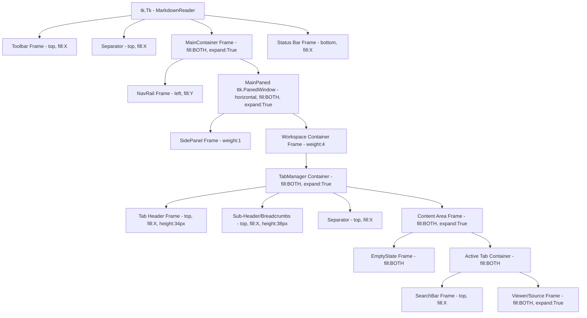

# UI Structure Blueprint

Questo documento descrive la gerarchia dei widget e le regole di layout del Friedrich - Document Reader. Serve come riferimento per prevenire regressioni visive durante le modifiche al codice.

## 🏗️ Gerarchia dei Widget (Layout Map)

L'applicazione utilizza un sistema di annidamento basato principalmente sul manager `pack`, con una `PanedWindow` centrale per la gestione flessibile degli spazi.

## 📏 Regole di Espansione (Packing Rules)

| Componente | Manager | Side | Fill | Expand | Note |
| :--- | :--- | :--- | :--- | :--- | :--- |
| **Toolbar** | `pack` | TOP | X | False | Altezza fissa definita dai widget interni. |
| **NavRail** | `pack` | LEFT | Y | False | Larghezza fissa (48px). |
| **MainPaned** | `pack` | LEFT | BOTH | True | Contiene il cuore dell'interfaccia. |
| **Sidebar** | `paned` | - | BOTH | - | Weight 1. Larghezza minima suggerita 220px. |
| **Workspace** | `paned` | - | BOTH | - | Weight 4. L'area di lettura principale. |
| **Status Bar** | `pack` | BOTTOM | X | False | Altezza fissa 22px. |

## ⚠️ Vincoli Critici
1. **NavRail Priority:** Deve essere sempre pacchettizzata per prima nel `MainContainer` per occupare l'intera altezza sinistra.
2. **PanedWindow Weights:** Il rapporto Sidebar:Workspace deve rimanere 1:4 per mantenere il focus sul contenuto.
3. **Z-Order:** L' `EmptyState` e l' `ActiveTab` container si alternano nell'area `Content`, uno solo deve essere visibile (pacchettizzato) alla volta.
